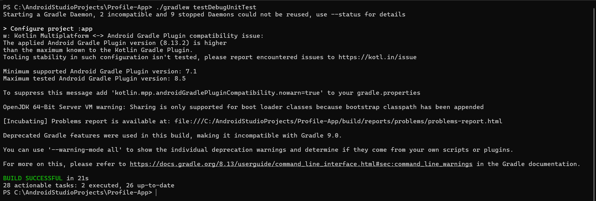

# Tugas Pertemuan 10 - Testing dan Dependency Injection

**Mata Kuliah:** Pengembangan Aplikasi Mobile  
**Program Studi:** Teknik Informatika ITERA  
**Tahun Akademik:** Genap 2025/2026

---

## 📋 Daftar Test Cases

### 1. Unit Test - NoteRepository (6 test cases)
| No | Test Case | Status |
|----|-----------|--------|
| 1 | test insertNote adds note successfully | ✅ Passed |
| 2 | test deleteNoteById removes correct note | ✅ Passed |
| 3 | test getNoteById returns correct note | ✅ Passed |
| 4 | test getNoteById returns null for non-existent id | ✅ Passed |
| 5 | test updateNote modifies existing note | ✅ Passed |
| 6 | test searchNotes filters by title | ✅ Passed |

### 2. Flow Test dengan Turbine (5 test cases)
| No | Test Case | Status |
|----|-----------|--------|
| 1 | searchNotes emits new values when notes are added | ✅ Passed |
| 2 | searchNotes emits updated values when note is deleted | ✅ Passed |
| 3 | searchNotes with query filters results dynamically | ✅ Passed |
| 4 | searchNotes with empty query returns all notes | ✅ Passed |
| 5 | searchNotes flow completes when repository is cleared | ✅ Passed |

### 3. Unit Test - NotesViewModel dengan MockK (5 test cases)
| No | Test Case | Status |
|----|-----------|--------|
| 1 | addNote calls repository insertNote | ✅ Passed |
| 2 | deleteNote calls repository deleteNoteById | ✅ Passed |
| 3 | getNote returns correct note from repository | ✅ Passed |
| 4 | updateNote calls repository updateNote | ✅ Passed |
| 5 | onSearchQueryChange updates searchQuery state | ✅ Passed |

### 4. UI Test - NotesScreen (6 test cases)
| No | Test Case | Status |
|----|-----------|--------|
| 1 | notes list displays all notes when state is Success | ✅ Passed |
| 2 | empty state shows Catatan tidak ditemukan message | ✅ Passed |
| 3 | loading state shows CircularProgressIndicator | ✅ Passed |
| 4 | error state shows error message | ✅ Passed |
| 5 | click FAB triggers onNavigateToAdd | ✅ Passed |
| 6 | click note card triggers onNavigateToDetail | ✅ Passed |

---

## 📸 Test Summary

---

## 📸 Test Execution Result

---

## 📊 Code Coverage

**Business Logic Coverage:** ≥ 60% (memenuhi target)

*Screenshot coverage dapat dilihat di atas*

---

## 🎥 Video Demo

[Klik di sini untuk menonton video demo](https://drive.google.com/file/d/1JRwnrr9dT8_-2qPz3ZfdClOq9U2JZdR3/view?usp=sharing)

> Video berisi: Menjalankan semua test dan menunjukkan hasilnya (durasi 45 detik)

---

## 🛠️ Setup Koin DI

Modules yang dikonfigurasi di `AppModule.kt`:

| Module | Component |
|--------|-----------|
| Data Module | `NoteRepository` |
| ViewModel Module | `NoteViewModel`, `ProfileViewModel` |