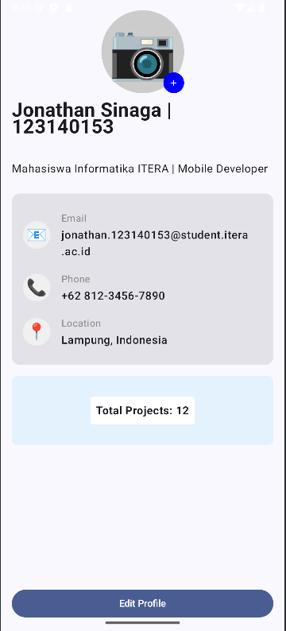

# My Profile App

Aplikasi profil sederhana menggunakan Jetpack Compose untuk memenuhi tugas Pertemuan 3.

## Screenshot

## Fitur
- Foto profil berbentuk lingkaran dengan badge
- Nama dan bio
- Informasi kontak (Email, Phone, Location)
- Card untuk membungkus informasi
- Box untuk efek layer
- Button Edit Profile

## Komponen yang Digunakan
- ✅ Column, Row, Box
- ✅ Card
- ✅ Text, Button, Image (placeholder)
- ✅ 3 Reusable Composables: 
  - `ProfileHeader`
  - `InfoItem`
  - `ProfileScreen` (utama)

## Cara Menjalankan
1. Clone repository
2. Buka di Android Studio
3. Run di emulator atau device Android

## Identitas
- **Nama**: Jonathan Sinaga
- **NIM**: 123140153